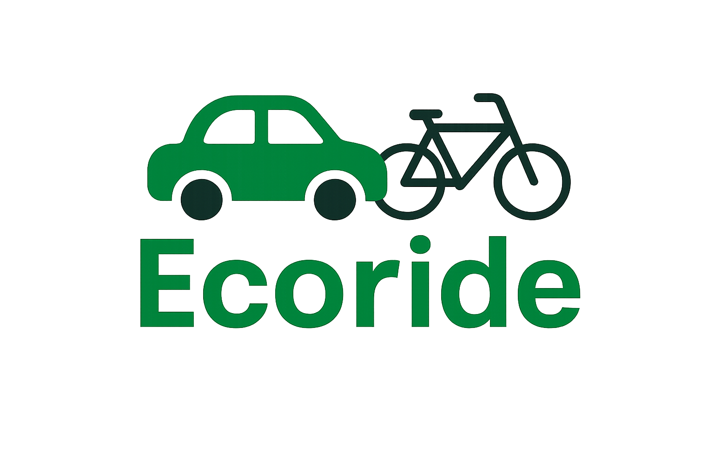

# 🌿 Projet Ecoride – Plan de Développement 2025

## 1. Présentation du projet
**Ecoride** est une plateforme numérique dédiée à la **mobilité durable et responsable**, visant à encourager les utilisateurs à adopter des comportements écoresponsables.  
L’application récompense les trajets écologiques — tels que les déplacements à vélo, à pied ou en covoiturage — par l’attribution d’**éco-points**.  

> 🟢 **Important** : la plateforme de covoiturage Ecoride ne gère **que les déplacements effectués en voiture**, dans le cadre d’un covoiturage partagé entre plusieurs usagers.

Ces éco-points permettent de valoriser les efforts écologiques des utilisateurs et peuvent être convertis en récompenses ou avantages auprès de partenaires.

---

## 2. Objectifs du projet
### Objectif général
Concevoir et développer une solution web complète (frontend + backend + base de données) permettant la gestion des utilisateurs et de leurs trajets écoresponsables.

### Objectifs spécifiques
- Créer un **backend Express.js** pour la gestion des utilisateurs et des éco-points.  
- Concevoir un **frontend React** ergonomique et responsive.  
- Mettre en place une **base de données MongoDB** hébergeant les utilisateurs, leurs trajets et points.  
- Connecter le frontend au backend via une API REST.  
- Fournir une documentation claire et un prototype fonctionnel pour la soutenance.

---

## 3. Fonctionnalités principales
### 👤 Gestion des utilisateurs
- Inscription / connexion / suppression d’un utilisateur.  
- Affichage des informations : nom, e-mail, éco-points.  
- Mise à jour du profil (données personnelles).  

### 🚗 Gestion des trajets (voiture uniquement)
- Enregistrement d’un trajet (type : covoiturage, voiture partagée).  
- Attribution automatique d’éco-points selon la distance parcourue.  
- Consultation de l’historique des trajets.  

### 🏆 Système de récompense
- Conversion des points en avantages (à définir ultérieurement).  
- Affichage du solde d’éco-points.  

### 📊 Tableau de bord administrateur
- Visualisation des utilisateurs inscrits.  
- Suppression / modification d’un compte.  
- Gestion des récompenses et statistiques globales.

---

## 4. Architecture technique
### 🧱 Schéma global
- **Frontend** : React + Vite (interface utilisateur responsive)  
- **Backend** : Node.js / Express.js (API REST)  
- **Base de données** : MongoDB (via Mongoose)  
- **Communication** : requêtes HTTP via Axios (fetch API)  
- **Environnement** : WSL / VS Code / GitHub / Postman  

### Détails d’implémentation
- **Structure du projet :**

- **Format d’échange des données** : JSON  
- **Port backend** : 3000  
- **Port frontend (Vite)** : 5173  

---

## 5. Contraintes techniques
- Projet **versionné sur GitHub**.  
- Code structuré (React Components / Express Routes).  
- Fonctionnel localement sous **WSL / Node 20+**.  
- Interface **responsive** (desktop et mobile).  
- Respect des standards **HTML5 / CSS3 / ES6**.  
- Backend doit exposer les routes REST :
- `GET /users` : liste des utilisateurs  
- `POST /users` : ajout d’un utilisateur  
- `DELETE /users/:id` : suppression  
- `GET /health` : test de disponibilité  

---

## 6. Priorisation du développement

| Étape | Description | Priorité |
|:------|:-------------|:---------:|
| 1️⃣ | Création de l’API Express + MongoDB (CRUD utilisateurs) | 🔥 Haute |
| 2️⃣ | Intégration du frontend React (affichage utilisateurs) | 🔥 Haute |
| 3️⃣ | Ajout du formulaire d’ajout et suppression d’utilisateurs | 🔥 Haute |
| 4️⃣ | Ajout du système de points et trajets | ⚙️ Moyenne |
| 5️⃣ | Tableau de bord et statistiques (admin) | ⚙️ Moyenne |
| 6️⃣ | Améliorations graphiques et responsive design | 💅 Basse |
| 7️⃣ | Documentation technique et fonctionnelle | 📘 Finale |

---

## 7. Livrables attendus
- **Code source complet** (frontend + backend).  
- **Base de données MongoDB** opérationnelle.  
- **Documentation utilisateur et technique** (`/docs/`).  
- **Démonstration fonctionnelle** pour la soutenance.  
- **PDF “Cahier des Charges” et “Plan de Développement”** inclus au dossier final.  

---

## 8. Auteur
**Projet Ecoride – Yves Mukuna Jamesy – 2025**  
📍 Formation : Développeur Web et Web Mobile (Studi)  
🖋️ Encadrement : Jury de soutenance – projet fil rouge
